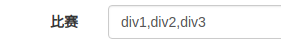
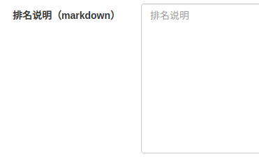
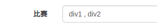

# CP网站说明文档

## 安装说明(基于Ubuntu18.04)

### 1. 安装Node(建议使用最新版)

```sh
> sudo apt install npm
> sudo npm i n -g
> sudo n lts
```

### 2. 安装Mongo

```sh
> sudo apt install mongodb
```

### 3. 安装Node依赖库

在`CP`目录中执行：

```sh
> npm i
```
### 4. 配置文件

将`config.example.yml`复制一份并命名为`config.yml`，根据情况修改相应内容，具体每个字段的功能如下：

```yml
SERVER: # 服务器相关的配置
  ADDRESS: 0.0.0.0 # 监听的地址，一般来说填0.0.0.0或者127.0.0.1
  PORT: 4399 # 监听的端口
  URL_PREFIX: http://localhost:4399 # 地址前缀，不以/结尾
  SECRET_KEYS: 'this is secret key' # 加密session用的key
  MAXAGE: 0 # 静态资源缓存时间,单位ms

MONGODB: # mongodb配置
  HOSTNAME: 127.0.0.1 # mongodb地址
  DATABASE: codeplus_test # 数据库名称

EMAIL: # 邮箱设置，用于找回密码/发送邮件等功能，使用SMTP发送邮件，请确保该邮箱开启了SMTP
  USER: unknow@163.com
  PASSWORD: abcdef # 163邮箱要求使用授权码登录，而不是密码
  HOST: smtp.163.com
  SSL: true

SUPPORT: codeplus@thusaac.org

OAUTH: # 可以使用其他方式进行登录
  GITHUB:
    CLIENT_ID: xxxxxxxxxxxxxxx
    CLIENT_SECRET: xxxxxxxxxxxxxxxxxxxxxxxxxxxx

STORAGE: # 储存，用于放置每场比赛的题目和数据等，见后文
  REPO: repositories
```

### 5. 初始化数据

**`CP`网站要求必须存在至少一个比赛才能够正常运行，而在最开始数据库中没有任何数据，所以我们需要通过脚本添加一张比赛。**

**在之后可以直接通过后台创建比赛。**

执行脚本：

```sh
> node tools/test.js
```

**请注意，如果在数据库中已经有比赛的情况下执行`tools/test.js`，则会修改第一场比赛的某些数据，请慎重操作。**

## 运行网站

网站运行`CP`网站需要运行两个文件：

* `src/app.js`: 网站的主体部分
* `src/daemon.js`: 主要负责发送邮件和统计数据，具体可以看看`src/daemon.js`的代码，并不复杂

### 使用PM2启动

#### 1. 安装pm2

```sh
> sudo npm i pm2 -g
```

#### 2. 启动

```sh
pm2 start -i 4 src/app.js
pm2 start src/daemon.js
```

`-i 4`是让pm2启动4个进程，4个进程之间会自动实现负载均衡。

## 网站管理

`CP`网站的管理界面地址是`/admin`。

### 1. 添加管理员

目前`CP`网站只能通过修改数据库的方式添加管理员：在数据库中找到对应的用户，将其`is_admin`设为`true`。


### 2. 添加比赛

在`管理比赛`界面，可以看到一个`创建比赛`按钮，点击此按钮即可创建比赛。


点击之后，可以在比赛列表中看到一场名为`这里是比赛标题`的比赛，这场比赛就是我们刚刚创建的比赛。


### 3. 比赛的各个属性说明


比赛标题，字面意思。


报名开始结束时间和比赛开始结束时间，字面意思。


本地仓库的名称，主要用于给选手下载数据和题解等，详见后述。


比赛的编号，第一场比赛为1,第二场为2,依次类推，主要用于比赛之间的排序（比如主页会展示最新的一场比赛，就是比赛编号最大的一场）。



本次比赛有哪些场次，用`,`隔开，比如`"div1,div2,div3"`。填写该字段之后，点击页面下方的`更新`按钮，就会自动产生如下的输入框：


这里需要填写`OJ`的对应比赛的编号，其中练习赛是所有人都会参加，其他比赛只有报名了相应场次才会参加，练习赛ID可以为空，表示没有练习赛。


勾选上之后表示快递地址填写结束，所有人都不能再填写，快递填写功能详见后述。


是否公开，字面意思，未公开的比赛只能在管理员界面看到。


比赛描述，字面意思，示例文件可以查看`docs/test.md`。


报名须知，字面意思，示例文件可以查看`docs/terms.md`。



排名说明，字面意思，对应比赛列表(`/contests`)中的排名说明。


在比赛结束后，可以在此处填上选手的排名。排名是纯文本格式的，分为若干行，其中第一行是表头，接下来每行是一个选手的排名。

在表头中，必须注意`rank`对应选手的排名，`id`对应用户的登录`username`，行内不同字段以`\t`分割，一个可能的示例如下：

```
rank	id	姓名	学校
1	user1	ZGG	清华大学
2	unknow	CXM	清华大学
```

### 4. 获奖与快递填写

`CP`网站支持获奖选手在比赛之后填写收取快递的地址，要实现这个功能需要以下步骤：

#### 更新全国快递数据库

这里主要是爬取了顺丰的快递数据，执行以下代码即可：

```sh
> node tools/fetch_express_database.js
```

**该步骤并非每次比赛都需要。**

#### 填写获奖选手

在比赛的管理页面的下方，可以看到一个填写`获奖选手`的输入框：


将本次比赛需要填写快递地址的选手的`username`填在此处即可，只有获奖的选手才会填写快递地址，未获奖选手不填写快递地址。

一个可能的示例如下：

```
user1
unknow
```

#### 下载选手填写的信息

然后可以从管理界面的比赛列表进入`快递信息`页面。


在这里可以看到快递填写的基本情况，以及下载填写情况。

#### 填写选手的快递信息

在管理比赛页面的下方，可以填写选手的获奖快递信息：


数据是纯文本格式，每行描述一个选手的数据，行内用`\t`分割，一个可能的示例如下：

```
user1	顺丰	376878997	卫衣一件
unknow	顺丰	376878997	卫衣一件
```

### 5. 计算Rating变化

计算Rating变化的脚本可以参考`tools/rating.js`，实际使用需要根据情况稍加修改。

计算出Rating变化之后，在管理比赛页面的下方Rating变化输入款中填入数据即可：


一个可能的输入示例如下：

```
user1	1300	1500	200
unknow	1500	1400	-100
```

### 6. 发布比赛公告

在比赛管理页面的最下方可以发布比赛公告，值得一提的是公告具有`隐藏名`功能，具有隐藏名的公告会被打码，但是自己的名称不会被打码。


### 7. 比赛数据和题解发放

`CP`网站具有下载数据和题解的功能，这里演示一下第三场CodePlus比赛的配置。

首先，我们在配置文件中有如下配置：


这表示我们的题目数据储存在`repositories`目录下，所以我们需要建立一个名为`repositories`的目录。

```sh
> mkdir repositories
```

然后，第三场CP比赛的题目仓库是`https://git.thusaac.org/publish/CodePlus3`，我们需要将其clone到`repositories`目录下，注意该仓库使用了`git lfs`,那么在clone的时候也需要使用`git lfs`。

```sh
> cd repositories
> git clone https://git.thusaac.org/publish/CodePlus3.git
```

在第三场比赛中，只有`div1`和`div2`，所以我们需要在比赛管理页面配置比赛场次：



并且，我们刚刚clone下来的目录名称就是`CodePlus3`，所以同样需要在比赛管理页面填上相应数据：


下一步，我们需要使用`tuack`渲染题目，按照`https://git.thusaac.org/publish/tuack`安装上`tuack`，然后在`repositories/CodePlus3`目录中执行：

```sh
> python -m tuack.ren tuoj
```

现在，就已经配置好了一部分，从比赛列表中进入`题目`，即可看到如下界面：


下一步，我们再把`repositories/CodePlus3`目录下的全部文件压缩成一个zip文件，命名为`download.zip`并放在`repositories/CodePlus3`中，即可提供一个下载链接：


实际上用户点击此下载链接就是下载`download.zip`。

最后，我们还需要实现一个功能即“提交链接”，在`repositories/CodePlus3`中创建一个文件`links.json`并写入如下数据：

```json
{
    "clouds": "https://loj.ac/problem/6299",
    "dance": "https://loj.ac/problem/6298",
    "game": "https://loj.ac/problem/6300",
    "moskva": "https://loj.ac/problem/6301",
    "parking": "https://loj.ac/problem/6302",
    "vote": "https://loj.ac/problem/6297"
}
```

完整版如下：


**这部分功能的代码在`src/services/chelper.js`中的`fetchZIPPath`，`fetchProblems`等相关函数中。**

## 邮件功能

**使用邮件功能必须启动`src/daemon.js`。**

### 1. 邮件模板

要发送邮件必须先创建邮件模板，一个邮件模板指明了邮件的内容。

邮件模板是一个`EJS`格式的`html`文件，在发送时会将其渲染成`html`发送。

在邮件模板渲染时，会置入一些变量，具体包含以下变量：

1. 模板默认变量


在创建模板时设置的，JSON格式。

2. 用户变量

渲染时会将找到该邮箱对应的用户，在邮件模板中将可以使用该用户对应的属性，比如nickname等。

如果没有找到对应的用户，则不会置入用户变量。

3. email变量

会添加`email`和`to`变量，均为本次邮件发送的目标邮件地址。

4. 任务变量

对于每个发送任务也可以有自己的变量。

**后面的同名变量会覆盖前面的变量。**

### 2. 发送邮件


本次发送的模板。


主题是之邮件发送给对方之后，对方看到的邮件主题。


邮件任务的优先级，**优先级越高的任务会先发送**。

* 订阅消息: 新比赛的邮件提醒就属于此类，**已经取消订阅的用户将不会收到订阅消息**。
* 推送消息: 提醒用户填写快递地址之类的邮件属于此类，主要区别在于不会受取消订阅的影响
* 及时消息: 优先级较高的邮件，比如找回密码，激活邮件等


收件人邮件地址，字面意思。
